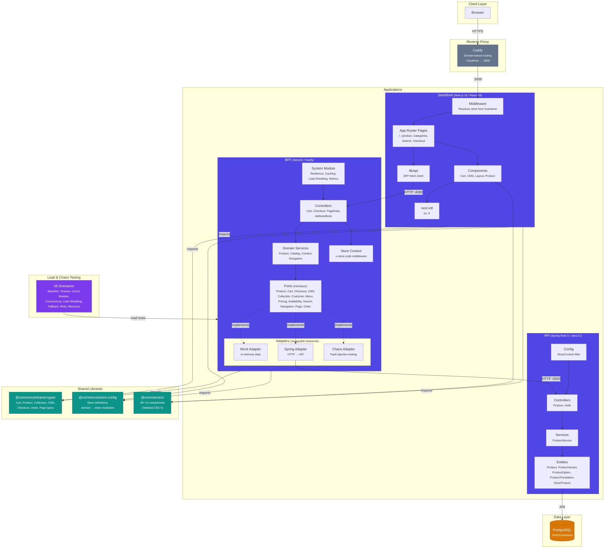
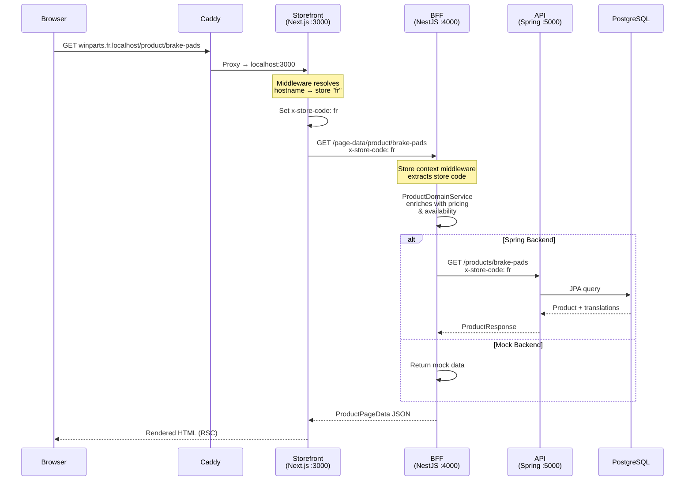
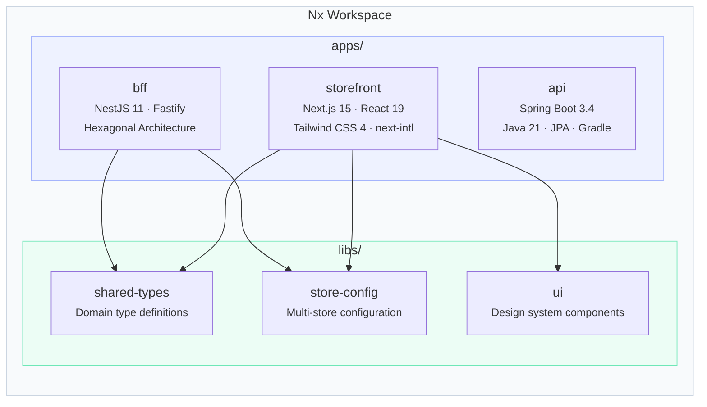
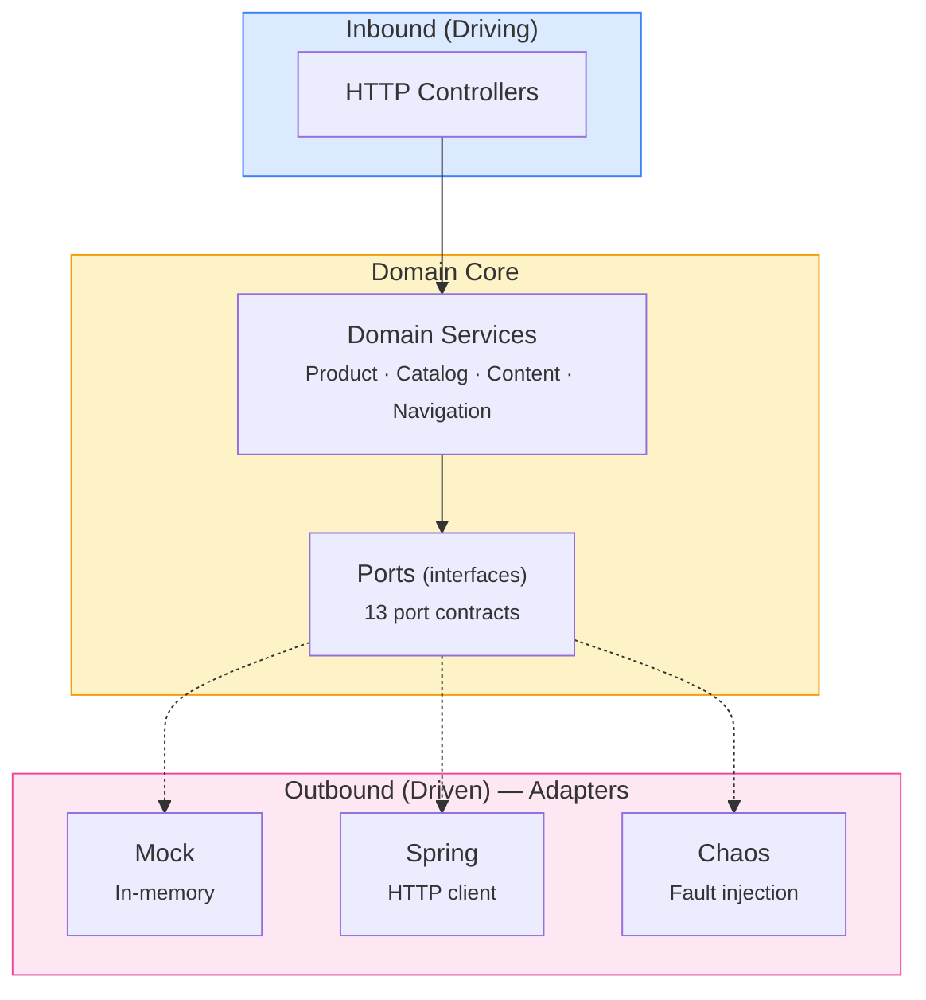
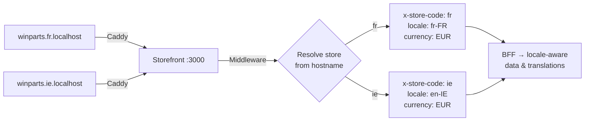

# Commerce Monorepo — Architecture

## High-Level Overview

## Request Flow

## Monorepo Structure

## BFF Hexagonal Architecture

## Multi-Store Resolution

## Tech Stack Summary

| Layer | Technology | Port |
|-------|-----------|------|
| Reverse Proxy | Caddy | 80/443 |
| Storefront | Next.js 15, React 19, Tailwind CSS 4, next-intl | 3000 |
| BFF | NestJS 11, Fastify | 4000 |
| API | Spring Boot 3.4, Java 21, JPA | 5000 |
| Database | PostgreSQL | 5432 |
| Build System | Nx, Gradle (API) | — |
| Load Testing | k6 | — |
