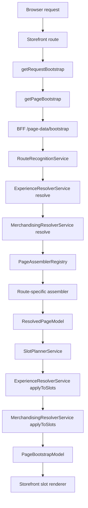
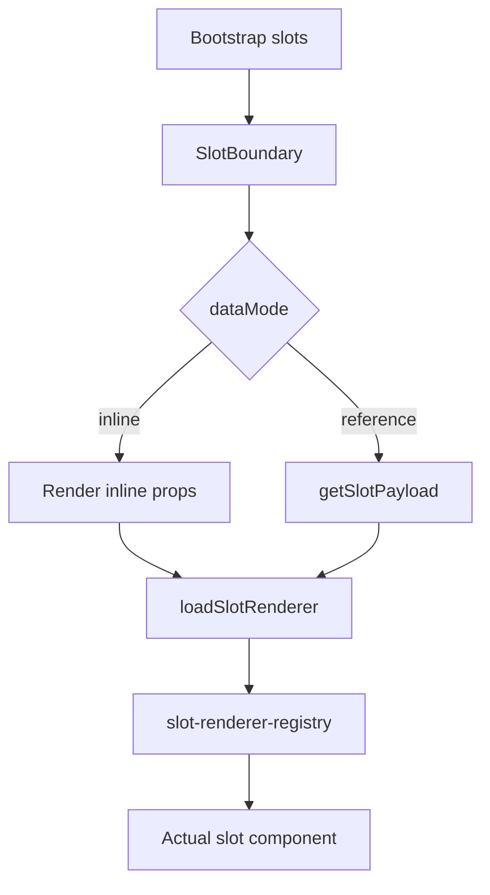
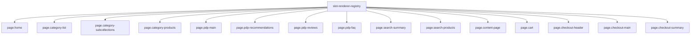

# Page Pipeline Diagrams

This document shows how each page flows through the current system, from request to BFF bootstrap to storefront rendering.

## Legend

- `RouteRecognitionService`: classifies the incoming path into a `routeKind`
- `PageAssembler`: builds the route-specific `ResolvedPageModel`
- `SlotPlannerService`: converts content into slot manifests
- `ExperienceResolverService`: applies experience rules like variants/hide-show behavior
- `MerchandisingResolverService`: applies merchandising variants and defaults
- `SlotBoundary`: storefront runtime that resolves and renders each slot

## Shared Bootstrap Pipeline



## Home Page

```mermaid
flowchart TD
  A[/] --> B[Route kind: home]
  B --> C[HomePageAssembler]
  C --> D[Resolved content node: home]
  D --> E[SlotPlanner default inline slot]
  E --> F[Renderer key: page.home]
  F --> G[home-slot]
```

Notes:

- Uses the default inline slot path from `ResolvedPageModel.content`
- Experience can still adjust presentation, but there is no custom slot planning branch

## Category List Page

```mermaid
flowchart TD
  A[/browse or localized equivalent] --> B[Route kind: category-list]
  B --> C[CategoryListPageAssembler]
  C --> D[Resolved content node: category-list]
  D --> E[SlotPlanner default inline slot]
  E --> F[Renderer key: page.category-list]
  F --> G[category-list-slot]
```

Notes:

- Single inline slot page
- Mostly a straightforward assembler-to-renderer flow

## Category Detail Page

```mermaid
flowchart TD
  A[/category/... ] --> B[Route kind: category-detail]
  B --> C[CategoryDetailPageAssembler]
  C --> D{Category shape}
  D -->|Has subcollections| E[Content node: category-subcollections]
  D -->|Has products| F[Content node: category-products]
  E --> G[Default inline slot]
  F --> H[Default inline slot]
  G --> I[Renderer: page.category-subcollections]
  H --> J[Renderer: page.category-products]
  I --> K[category-subcollections-slot]
  J --> L[category-products variant renderer]
```

Notes:

- The assembler decides whether the page is a subcollection landing page or a product listing page
- Experience and merchandising rules most commonly affect `page.category-products`

## Product Detail Page

```mermaid
flowchart TD
  A[/product/... ] --> B[Route kind: product-detail]
  B --> C[ProductDetailPageAssembler]
  C --> D[Resolved content node: product-detail]
  D --> E[SlotPlanner custom PDP plan]
  E --> F[slot:pdp-main inline blocking]
  E --> G[slot:pdp-recommendations deferred reference]
  E --> H[slot:pdp-reviews deferred reference]
  E --> I[slot:pdp-faq deferred reference]
  F --> J[Renderer: page.pdp-main]
  G --> K[Renderer: page.pdp-recommendations]
  H --> L[Renderer: page.pdp-reviews]
  I --> M[Renderer: page.pdp-faq]
```

Notes:

- PDP is explicitly orchestrated in `SlotPlannerService`
- Main product content is blocking and inline
- Recommendations, reviews, and FAQ are deferred slot fetches

## Search Page

```mermaid
flowchart TD
  A[/search?q=...] --> B[Route kind: search]
  B --> C[SearchPageAssembler]
  C --> D[Resolved content node: search-results]
  D --> E[SlotPlanner custom search plan]
  E --> F[slot:search-summary inline blocking]
  E --> G[slot:search-products deferred reference]
  F --> H[Renderer: page.search-summary]
  G --> I[Renderer: page.search-products]
```

Notes:

- Summary and controls render first
- Product results can be streamed/deferred
- Merchandising and experience can change the `page.search-products` variant

## Content Page

```mermaid
flowchart TD
  A[/page/... ] --> B[Route kind: content-page]
  B --> C[ContentPageAssembler]
  C --> D[Resolved content node: content-page]
  D --> E[Default inline slot]
  E --> F[Renderer key: page.content-page]
  F --> G[content-page-slot]
```

Notes:

- Simple page path
- No custom slot planner branch today

## Cart Page

```mermaid
flowchart TD
  A[/cart] --> B[Route kind: cart]
  B --> C{cartUxMode is page?}
  C -->|No| D[Bootstrap returns 404 for route]
  C -->|Yes| E[CartPageAssembler]
  E --> F[Resolved content node: cart-page]
  F --> G[Default inline slot]
  G --> H[Renderer key: page.cart]
  H --> I[cart-slot]
```

Notes:

- Cart route is gated by store experience settings
- If cart is configured as drawer-only, the route is intentionally blocked

## Checkout Page

```mermaid
flowchart TD
  A[/checkout] --> B[Storefront app/checkout/page.tsx]
  B --> C[getCart]
  C --> D{Cart exists in storefront?}
  D -->|No| E[redirect to home]
  D -->|Yes| F[getRequestBootstrap]

  F --> G[BFF route kind: checkout]
  G --> H[CheckoutPageAssembler]
  H --> I[Read cart cookie from request]
  I --> J{Cart exists in BFF?}
  J -->|No| K[Assembler returns null, bootstrap becomes 404]
  J -->|Yes| L[getCheckoutConfig]
  L --> M[Resolved content node: checkout-page]

  M --> N[SlotPlanner custom checkout plan]
  N --> O[slot:checkout-header]
  N --> P[slot:checkout-main]
  N --> Q[slot:checkout-summary]

  O --> R[Renderer: page.checkout-header]
  P --> S[Renderer: page.checkout-main]
  Q --> T[Renderer: page.checkout-summary]

  S --> U{variantKey}
  U -->|single-page| V[SinglePageCheckout]
  U -->|multi-step| W[MultiStepCheckout]
  U -->|express| X[ExpressCheckout]

  T --> Y[checkout-summary-slot to OrderSummary]
```

Notes:

- Checkout is now bootstrap-driven like the other pages, but still uses a dedicated shell component on the storefront
- `page.checkout-main` decides the flow through `variantKey`
- Both storefront and BFF need access to the cart state for checkout to render successfully

## Storefront Slot Rendering



## Current Renderer Map


