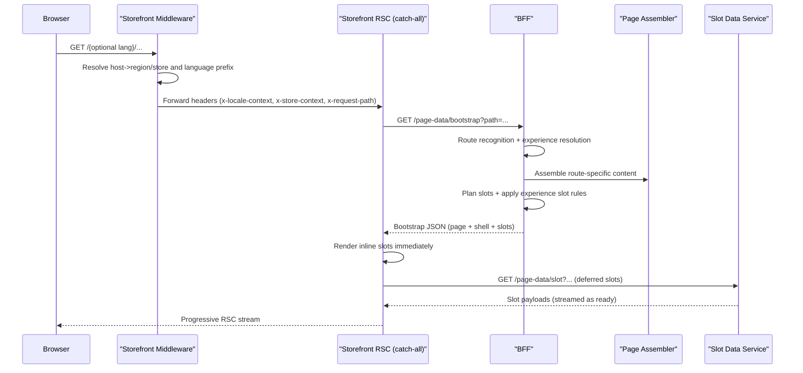

# Product Vision and Handover Guide

## 1) Purpose

This document describes the current end-to-end product architecture for the Nx monorepo storefront platform in `/NxNextNest_PoC`.

It is intended to be a complete handover for engineering teams covering:

1. Product and architecture decisions.
2. Ownership boundaries (BFF vs Storefront).
3. Runtime behavior and request lifecycle.
4. Contracts and sample payloads.
5. Theming, experience profiles, routing, i18n, and cart behavior.
6. Operational guardrails, performance model, and testing guidance.

---

## 2) Product Definition

The platform is a server-rendered, multi-store, multi-language ecommerce storefront with:

1. One storefront app using a catch-all App Router route.
2. One NestJS BFF as orchestration and routing authority.
3. A slot-manifest architecture for streaming and deferred content.
4. Store-level experience and theme control owned by BFF metadata.
5. Region-domain + language-path URL semantics.

### Core principle

Storefront is a thin rendering runtime.  
BFF owns orchestration, route resolution, URL generation, and experience assignment.

---

## 3) Architecture Decisions (Current)

1. **Single bootstrap endpoint**: `GET /page-data/bootstrap` is the primary page composition API.
2. **Single slot endpoint**: `GET /page-data/slot` serves deferred slot payloads.
3. **Slot payload model**: bootstrap returns manifest + inline critical data + references for deferred data.
4. **Streaming first**: deferred slots render through RSC `Suspense`.
5. **Route recognition**: BFF uses `path-to-regexp` compiled matchers plus slug indexes.
6. **Canonical identity routing**: paths resolve to canonical refs (`productHandle`, `categoryKey`, `pageHandle`).
7. **Domain owns region**: host determines commercial context (region/market/currency/store).
8. **Language via path prefix**: optional first segment (`/en`, `/es`, `/nl`, `/fr`) overrides display language.
9. **Unprefixed URL rule**: unprefixed paths always map to domain default language.
10. **Experience ownership**: domain/store controls experience (not current language).
11. **Theme ownership split**:
    1. BFF returns semantic theme identity (`themeKey`, `themeRevision`, `themeTokenPack`).
    2. Storefront owns CSS implementation and applies token packs.
12. **Store flag branding ownership split**:
    1. BFF returns render-ready flag metadata (`storeFlagIconSrc`, `storeFlagIconLabel`) per store/domain.
    2. Storefront does not map countries/channels/flags; it only renders BFF-provided values.
13. **Light mode only**: dark mode was intentionally removed platform-wide.
14. **Cart cookie lifecycle**: BFF is authoritative owner of `cartId` cookie via `/cart/current*`.
15. **Cart UX mode**: per-store configurable `drawer` or `page`.
16. **Store selector behavior**: hard navigation only (`window.location.assign`) to reset client state cleanly.
17. **Localization fallback**:
    1. Missing translated slug/text falls back to canonical values.
    2. Telemetry and audits surface gaps.
18. **Merchandising modes**:
    1. BFF resolves `discovery | conversion | clearance` by `store + routeKind + language`.
    2. BFF applies default sort policy and slot variant/include overrides.
    3. Storefront only renders selected variants and never makes merchandising decisions.
19. **BFF-authoritative i18n runtime**:
    1. `next-intl` was removed from storefront runtime and build wiring.
    2. Bootstrap `shell.messages` is the sole translation payload for storefront rendering.
    3. BFF owns interpolation/pluralization through `IntlMessageFormat`.

---

## 4) Ownership Model

## BFF owns

1. Route recognition and canonical entity resolution.
2. URL generation policy and slug mapping.
3. Bootstrap and slot payload composition.
4. Experience profile and slot variant instructions.
5. Store-to-theme assignment metadata.
6. Store-flag display metadata assignment (`storeFlagIconSrc`, `storeFlagIconLabel`).
7. Region/language domain config and switch URL resolution.
8. Cart identity cookie lifecycle and cart APIs.
9. Link localization normalization and auditing.
10. Resilience/load-shedding/cache headers/ETags.
11. Merchandising policy resolution and mode-to-variant assignment.
12. i18n negotiation, catalog lookup, and dynamic message formatting.

## Storefront owns

1. Rendering runtime (RSC + client islands where needed).
2. Catch-all route shell and component rendering.
3. Semantic theme CSS token packs and Tailwind classes.
4. API facades/proxies for browser-facing interactions (`/api/cart/*`, `/api/i18n/switch`).
5. Store selector modal UI.
6. Minimal link prefetch policy (`SmartLink`) and deferred shell hydration.
7. Opaque rendering of BFF-provided branding fields only (no country/channel/store mapping logic).
8. Rendering of BFF-selected merchandising variants only.
9. Thin translation lookup runtime over BFF `shell.messages` payloads.
10. No locale negotiation, pluralization, or business formatting logic.

## Downstream commerce systems own

1. Long-term source of translated commerce content.
2. Catalog availability and business data truth.

---

## 5) Runtime Request Lifecycle



---

## 6) URL Model: Region + Language

## Region

1. Region/commercial context comes from domain host.
2. Examples:
   1. `storefront.example.com` -> US context.
   2. `storefront.es.example.com` -> ES context.
   3. `storefront.nl.example.com` -> NL context.

## Language

1. Non-default language uses explicit prefix (`/en/...`, `/es/...`, `/nl/...`, `/fr/...`).
2. Default language is unprefixed on that domain.
3. Default-language prefixed URL is redirected to unprefixed canonical.

## Deterministic rules

1. Prefix language takes precedence when present.
2. Without prefix, language is domain default.
3. `pref_lang` cookie does **not** override unprefixed route parsing.
4. Legacy mixed links may be recovered by BFF fallback recognizer and canonicalized.

---

## 7) Public API Surface

## 7.1 i18n endpoints

1. `GET /i18n/domain-config`
   1. Returns domain-store bindings, language matrix, theme metadata, store-flag metadata, and cart UX metadata.
   2. Returns strong content-derived ETag.
2. `GET /i18n/messages`
   1. Returns namespace message payload by locale (BFF-owned translation source of truth).
   2. Kept as supporting/debug surface; storefront runtime renders from bootstrap `shell.messages`.
3. `POST /i18n/switch-url`
   1. Input: current path/query/source host + target region/language.
   2. Output: canonical target URL and fallback reason metadata.

## 7.2 page-data endpoints

1. `GET /page-data/bootstrap`
2. `GET /page-data/slot`
3. `GET /page-data/layout`
4. Legacy convenience endpoints still exist (`/page-data/home`, `/page-data/search`, etc.).

## 7.3 cart endpoints

1. Cookie-based v2:
   1. `POST /cart/current`
   2. `GET /cart/current`
   3. `DELETE /cart/current`
   4. `POST /cart/current/lines`
   5. `PATCH /cart/current/lines`
   6. `DELETE /cart/current/lines`
2. ID-based v1 endpoints are still present for compatibility.

---

## 8) Contract Examples

## 8.1 `GET /page-data/bootstrap` example

Request:

```http
GET /page-data/bootstrap?path=%2Fes%2Fproducto%2Fkit-coilover-ajustable&locale=es-ES&language=es&region=US&currency=USD&market=US&domain=storefront.example.com
```

Response (representative):

```json
{
  "page": {
    "schemaVersion": 2,
    "path": "/es/producto/kit-coilover-ajustable",
    "status": 200,
    "routeKind": "product-detail",
    "requestedPath": "/es/producto/kit-coilover-ajustable",
    "resolvedPath": "/es/producto/kit-coilover-ajustable",
    "canonicalPath": "/product/coilover-kit",
    "seo": {
      "title": "Kit Coilover Ajustable",
      "description": "..."
    },
    "localeContext": {
      "locale": "es-ES",
      "language": "es",
      "region": "US",
      "currency": "USD",
      "market": "US",
      "domain": "storefront.example.com"
    },
    "canonicalUrl": "https://storefront.example.com/es/producto/kit-coilover-ajustable",
    "alternates": {
      "en-US": "https://storefront.example.com/product/coilover-kit",
      "es-US": "https://storefront.example.com/es/producto/kit-coilover-ajustable"
    },
    "matchedRuleId": "product-detail",
    "assemblerKey": "product-detail.v1",
    "assemblyVersion": "v1",
    "requestId": "8a2f3d5f-2a8f-4eb2-92dc-8f70f7548ad7",
    "cacheHints": {
      "maxAgeSeconds": 60,
      "staleWhileRevalidateSeconds": 120
    },
    "merchandisingApplied": {
      "mode": "clearance"
    }
  },
  "shell": {
    "namespaces": ["common", "nav", "cart", "page"],
    "messages": { "...": "..." },
    "experience": {
      "storeKey": "store-a",
      "experienceProfileId": "exp-store-a-v1",
      "storeFlagIconSrc": "/icons/eu.svg",
      "storeFlagIconLabel": "European Union",
      "themeKey": "theme-default",
      "themeRevision": "2026-q3-v1",
      "themeTokenPack": "theme-default",
      "language": "es",
      "defaultLanguage": "en",
      "supportedLanguages": ["en", "es", "nl", "fr"],
      "cartUxMode": "drawer",
      "cartPath": "/es/carrito",
      "openCartOnAdd": true,
      "merchandisingMode": "clearance",
      "merchandisingProfileId": "merch-store-a-product-clearance-v1",
      "layoutKey": "layout-default"
    }
  },
  "slots": [
    {
      "id": "slot:pdp-main",
      "rendererKey": "page.pdp-main",
      "priority": "critical",
      "stream": "blocking",
      "dataMode": "inline",
      "presentation": { "variantKey": "default" },
      "inlineProps": { "...": "..." },
      "revalidateTags": [
        "products",
        "products:lang:es",
        "experience:exp-store-a-v1"
      ],
      "staleAfterSeconds": 300
    },
    {
      "id": "slot:pdp-recommendations",
      "rendererKey": "page.pdp-recommendations",
      "priority": "deferred",
      "stream": "deferred",
      "dataMode": "reference",
      "presentation": { "variantKey": "default" },
      "slotRef": {
        "endpoint": "/page-data/slot",
        "query": {
          "slotId": "slot:pdp-recommendations",
          "path": "/es/producto/kit-coilover-ajustable",
          "productHandle": "coilover-kit",
          "locale": "es-ES",
          "language": "es",
          "region": "US",
          "currency": "USD",
          "market": "US",
          "domain": "storefront.example.com"
        },
        "ttlSeconds": 120
      },
      "revalidateTags": ["products:coilover-kit:recs", "products:lang:es"],
      "staleAfterSeconds": 120,
      "fallbackKey": "slot.fallback.recommendations"
    }
  ]
}
```

## 8.2 `GET /page-data/slot` example

Request:

```http
GET /page-data/slot?slotId=slot:pdp-recommendations&path=%2Fes%2Fproducto%2Fkit-coilover-ajustable&productHandle=coilover-kit&locale=es-ES&language=es&region=US&currency=USD&market=US&domain=storefront.example.com
```

Response:

```json
{
  "slotId": "slot:pdp-recommendations",
  "rendererKey": "page.pdp-recommendations",
  "props": {
    "products": [
      {
        "handle": "performance-air-filter",
        "path": "/es/producto/filtro-aire-rendimiento"
      }
    ]
  },
  "presentation": { "variantKey": "default" },
  "revalidateTags": ["products:coilover-kit:recs", "products:lang:es"],
  "staleAfterSeconds": 120,
  "slotVersion": "2026-03-15-region-language-v1",
  "requestId": "8f2f170c-c727-4039-a58c-2f5dbf6d4565"
}
```

## 8.3 `POST /i18n/switch-url` example

Request:

```json
{
  "path": "/es/producto/kit-coilover-ajustable",
  "query": {},
  "sourceHost": "storefront.example.com",
  "sourceOrigin": "http://storefront.example.com:3000",
  "targetRegion": "NL",
  "targetLanguage": "nl"
}
```

Response:

```json
{
  "targetUrl": "http://storefront.nl.example.com:3000/product/coilover-kit",
  "resolved": {
    "routeKind": "product-detail",
    "fallbackApplied": false
  }
}
```

## 8.4 Cart mutation example

Request:

```http
POST /cart/current/lines
Cookie: cartId=cart-123
Content-Type: application/json
```

```json
{
  "lines": [{ "merchandiseId": "var-front-0", "quantity": 1 }]
}
```

Response:

1. Returns authoritative cart JSON.
2. May return `Set-Cookie: cartId=...` if cart is newly created or rotated.

---

## 9) Route Recognition and Slug System

## Matcher engine

BFF compiles `path-to-regexp` rules per locale static segments:

1. `/`
2. `/{searchSegment}`
3. `/{productSegment}/:productSlug`
4. `/{categoriesSegment}`
5. `/{categoriesSegment}/*categoryPath`
6. `/{cartSegment}`
7. `/:pageSlug`

## Canonical refs

After matching, BFF resolves:

1. Product slug -> `productHandle`.
2. Category path -> `categoryKey`.
3. Page slug -> `pageHandle`.

Everything downstream uses canonical refs.

## Prefixing

`SlugMapperService.withLanguagePrefix` applies prefix only for non-default language for current domain.

---

## 10) Page Assembly and Slot Planning

## Internal assemblers

Each route kind has a dedicated assembler:

1. `home`
2. `category-list`
3. `category-detail`
4. `product-detail`
5. `search`
6. `content-page`
7. `cart`

## Slot strategy

1. Critical content may be inline blocking.
2. Expensive content is deferred via `slotRef`.
3. Slot planner enforces critical inline payload budget.
4. Slot data service supports debug delay for PDP reviews (`DEBUG_PDP_REVIEWS_DELAY_MS`) to prove streaming behavior.

---

## 11) Experience Profiles

Profiles are BFF catalog entries mapping:

1. `storeKey + routeKind` -> `layoutKey + slotRules`
2. `slotRules` can set:
   1. `include` (omit slot)
   2. `variantKey`
   3. `layoutKey`
   4. `density`
   5. `flags`

### Important current rule

Experience resolution is locale-agnostic.  
Store/domain controls experience, language switch does not alter experience profile.

### Variant dispatch

Storefront resolves `rendererKey + variantKey` with an allowlisted async server loader map in:

1. `/NxNextNest_PoC/apps/storefront/components/page-renderer/slot-renderer-registry.ts`

Unknown variant falls back to `default` with warning.

---

## 12) Merchandising Modes

Merchandising is a dedicated BFF layer independent from theme and layout assignment.

## Modes

1. `discovery`: baseline browse behavior; default variants.
2. `conversion`: conversion-oriented variants and default sort intent.
3. `clearance`: sell-through variants and optional slot suppression for low-priority PDP content.

## Resolution model

1. Selector precedence:
   1. `store + routeKind + language`
   2. `store + routeKind + *`
   3. `store + * + language`
   4. `store + * + *`
   5. global default
2. Resolved fields:
   1. `merchandisingMode`
   2. `merchandisingProfileId`
   3. optional `defaultSortSlug`
   4. `slotRules` (variant/include/layout/density/flags)

## Application order (critical)

1. Base slot plan from `SlotPlannerService`.
2. Experience rules applied.
3. Merchandising rules applied last (last-wins).
4. User sort query always overrides merchandising default sort.

## Phase-1/2 variant map

1. `page.category-products`:
   1. `default`
   2. `clp-list-v1`
   3. `clp-clearance-v1`
2. `page.search-products`:
   1. `default`
   2. `search-list-v1`
   3. `search-clearance-v1`

---

## 13) Theme System

## Theme assignment

BFF returns semantic theme identity only:

1. `themeKey`
2. `themeTokenPack`
3. `themeRevision`

No CSS values are sent over API.

## Theme packs (storefront-owned)

Current packs:

1. `theme-default` (blue accent, medium control radius)
2. `theme-green` (green accent, full control radius)
3. `theme-orange` (orange accent, md control radius)

Loaded in root layout as:

```tsx
<link rel="stylesheet" href={theme.stylesheetHref} />
```

This is intentional and allows one token pack per request.

## Light-only policy

1. `color-scheme: light`
2. No dark mode branches/classes.
3. CI guard script enforces removal of dark mode markers.

## Store flag branding policy

1. BFF returns render-ready metadata:
   1. `storeFlagIconSrc` (example `/icons/netherlands.svg`)
   2. `storeFlagIconLabel` (example `Netherlands`)
2. Storefront renders those values directly in shell badge components (`LogoSquare`) with ``.
3. Flags are loaded over the network from `/public/icons` assets.
4. Storefront must not contain domain/country/channel-to-flag mapping logic.
5. If branding values are missing, storefront uses generic fallback values (`/icons/eu.svg`, `Store`) only as a defensive runtime default.

---

## 14) Store Mapping (Current)

From BFF `domainConfig`:

1. `storefront.example.com`
   1. `store-a`
   2. default language `en`
   3. theme `theme-default`
   4. store flag metadata: `storeFlagIconSrc=/icons/eu.svg`, `storeFlagIconLabel=European Union`
   5. cart UX `drawer`
2. `storefront.es.example.com`
   1. `store-b`
   2. default language `es`
   3. theme `theme-green`
   4. store flag metadata: `storeFlagIconSrc=/icons/spain.svg`, `storeFlagIconLabel=Spain`
   5. cart UX `page`
3. `storefront.nl.example.com`
   1. `store-c`
   2. default language `nl`
   3. theme `theme-orange`
   4. store flag metadata: `storeFlagIconSrc=/icons/netherlands.svg`, `storeFlagIconLabel=Netherlands`
   5. cart UX `page`

All stores currently support languages: `en`, `es`, `nl`, `fr`.

---

## 15) Cart Model

## Identity and cookie ownership

1. BFF owns `cartId` issuance/rotation/clearing.
2. Storefront does not author `cartId`.
3. Storefront API routes proxy to BFF and forward `Set-Cookie`.

## UI mode

1. `drawer` mode:
   1. navbar cart is a button.
   2. no cart page link is rendered.
   3. direct `/cart` route is blocked by BFF (404).
2. `page` mode:
   1. navbar cart is a link to localized cart path.
   2. cart page route is enabled.

## Mutation and shared state

1. Shared `CartProvider` is source of truth for cart state.
2. Optimistic mutations are applied immediately.
3. Authoritative reconciliation replaces state with BFF response.
4. On failure, rollback to pre-mutation snapshot.
5. Mutations are serialized per tab to avoid out-of-order clobbering.

---

## 16) Store Selector Model

UI opens modal with:

1. Region
2. Language

Apply flow:

1. Client posts to `/api/i18n/switch`.
2. Storefront route calls BFF `/i18n/switch-url`.
3. Response includes canonical `targetUrl`.
4. Storefront sets `pref_region` + `pref_lang`.
5. Client hard navigates with `window.location.assign(targetUrl)`.

Rationale: hard navigation guarantees clean state reset across major context switches.

---

## 17) i18n Runtime and Commerce Localization

Current implementation localizes:

1. Shell translations from BFF bootstrap `shell.messages` (no storefront i18n library runtime).
2. Slugs/static segments.
3. Commerce text from mock adapters (phase implementation).
4. Product/category/menu/page/CMS labels where catalogs are available.

### Must-meet runtime guarantees

1. Unprefixed content URLs always resolve to domain default language.
2. Prefixed content URLs always resolve to prefix language.
3. `pref_lang` does not force parsing of unprefixed content routes.
4. Default-language prefixed URLs redirect to unprefixed canonical.
5. Non-default languages canonicalize to prefixed URLs.
6. Browser back/forward must not 404 due to cookie-path language mismatch.
7. Storefront does not import `next-intl`.
8. BFF is authoritative for negotiation, message payload, and formatting.

Fallback policy:

1. Missing localized field/slug falls back to canonical field/slug.
2. This is expected and currently acceptable until data coverage is complete.

---

## 18) Link Localization Integrity

Policy:

1. Default language links are unprefixed.
2. Non-default language links are prefixed.
3. Applies to all internal link surfaces.

Implementation:

1. BFF normalizes path fields at bootstrap and slot response boundaries.
2. Localization audit can be returned with diagnostics in debug mode.
3. Violations are logged with request id and sample paths.

---

## 19) Performance and Scalability Model

## Latency/throughput

BFF includes:

1. load shedding
2. per-operation resilience/timeouts/retries
3. route and slot metrics
4. request IDs and structured logs
5. merchandising profile/mode resolution metrics

## Cache behavior

1. Bootstrap and slot endpoints return `ETag`, `Cache-Control`, `Vary`, `X-Request-Id`.
2. Cache tags include content, language, experience, and theme dimensions.
3. Storefront uses Next cache APIs with request-level dedupe and tagging.

## Prefetch policy

`SmartLink` uses conservative defaults:

1. Shell links can prefetch.
2. High-cardinality content links avoid aggressive prefetching.

---

## 20) Operational Guardrails

Current scripts:

1. `npm run prefetch:check`
2. `npm run theme:guard`
3. `npm run theme:catalog:guard`
4. `npm run theme:light-only:guard`
5. `npm run i18n:runtime:guard`
6. `npm run theme-pack:wiring`
7. `npm run storefront:css:budget`
8. `npm run storefront:theme:ci`

These enforce:

1. no aggressive list prefetch patterns
2. no deprecated theme keys
3. no dark mode markers
4. no `next-intl` runtime references in storefront
5. correct theme pack wiring
6. CSS size budget control

---

## 21) Local Development and Testing

## Hosts setup

Examples:

1. `127.0.0.1 storefront.example.com`
2. `127.0.0.1 storefront.es.example.com`
3. `127.0.0.1 storefront.nl.example.com`

## Run

1. `npm run dev:bff`
2. `npm run dev:storefront`

## Validate key flows

1. Cross-language navigation keeps prefix policy.
2. Cross-region switch builds canonical URL and preserves entity where possible.
3. Experience remains stable when language changes on same domain.
4. Theme differs by store domain.
5. Cart UX follows store policy (`drawer` vs `page`).
6. Deferred slots stream independently.

---

## 22) Known Constraints and Tradeoffs

1. Missing translation catalogs still cause canonical fallback in some slugs/commerce text.
2. Experience profile type still includes `locale` for compatibility, but runtime selection is store+route based.
3. Cart v1 ID-path endpoints remain for migration compatibility.
4. Deferred slot fetch is server-side RSC deferred (not client-trigger lazy fetch by default).
5. Merchandising profile catalog is currently code-backed; config-service-backed control plane is future work.

---

## 23) Module Map (Primary Files)

## Shared contracts

1. `/NxNextNest_PoC/libs/shared-types/src/index.ts`

## BFF

1. `/NxNextNest_PoC/apps/bff/src/modules/page-data/page-data.controller.ts`
2. `/NxNextNest_PoC/apps/bff/src/modules/page-data/bootstrap-orchestrator.service.ts`
3. `/NxNextNest_PoC/apps/bff/src/modules/page-data/slot-planner.service.ts`
4. `/NxNextNest_PoC/apps/bff/src/modules/page-data/slot-data.service.ts`
5. `/NxNextNest_PoC/apps/bff/src/modules/page-data/routing/route-matcher.factory.ts`
6. `/NxNextNest_PoC/apps/bff/src/modules/page-data/routing/route-recognition.service.ts`
7. `/NxNextNest_PoC/apps/bff/src/modules/slug/slug-mapper.service.ts`
8. `/NxNextNest_PoC/apps/bff/src/modules/experience/experience-profile.service.ts`
9. `/NxNextNest_PoC/apps/bff/src/modules/merchandising/merchandising-resolver.service.ts`
10. `/NxNextNest_PoC/apps/bff/src/modules/i18n/switch-url.service.ts`
11. `/NxNextNest_PoC/apps/bff/src/modules/i18n/i18n.service.ts`
12. `/NxNextNest_PoC/apps/bff/src/modules/cart/cart.controller.ts`
13. `/NxNextNest_PoC/apps/bff/src/adapters/mock/mock-data.ts`

## Storefront

1. `/NxNextNest_PoC/apps/storefront/middleware.ts`
2. `/NxNextNest_PoC/apps/storefront/app/[[...page]]/page.tsx`
3. `/NxNextNest_PoC/apps/storefront/lib/bootstrap.ts`
4. `/NxNextNest_PoC/apps/storefront/lib/api/index.ts`
5. `/NxNextNest_PoC/apps/storefront/components/page-renderer/slot-boundary.tsx`
6. `/NxNextNest_PoC/apps/storefront/components/page-renderer/slot-renderer-registry.ts`
7. `/NxNextNest_PoC/apps/storefront/components/layout/navbar/store-selector-modal.tsx`
8. `/NxNextNest_PoC/apps/storefront/app/api/i18n/switch/route.ts`
9. `/NxNextNest_PoC/apps/storefront/app/api/cart/_proxy.ts`
10. `/NxNextNest_PoC/apps/storefront/components/cart/cart-context.tsx`
11. `/NxNextNest_PoC/apps/storefront/lib/i18n/messages-context.tsx`
12. `/NxNextNest_PoC/apps/storefront/lib/i18n/translate.ts`
13. `/NxNextNest_PoC/apps/storefront/components/logo-square.tsx`
14. `/NxNextNest_PoC/apps/storefront/public/theme-packs/theme-default.css`
15. `/NxNextNest_PoC/apps/storefront/public/theme-packs/theme-green.css`
16. `/NxNextNest_PoC/apps/storefront/public/theme-packs/theme-orange.css`
17. `/NxNextNest_PoC/apps/storefront/components/page-renderer/slots/category-products/clp-clearance-v1/server.tsx`
18. `/NxNextNest_PoC/apps/storefront/components/page-renderer/slots/search-products/search-clearance-v1/server.tsx`

---

## 24) Team Handover Checklist

1. Understand and keep the BFF/storefront ownership boundary.
2. Add new UX variants by updating BFF profile + storefront allowlisted variant module.
3. Add new themes by:
   1. creating token pack CSS in storefront,
   2. allowlisting pack,
   3. assigning via BFF domain config.
4. Add or change store flag branding by updating BFF `domainConfig` fields only:
   1. `storeFlagIconSrc`
   2. `storeFlagIconLabel`
      Storefront should require no mapping changes.
5. Add new language by:
   1. extending language enums/catalogs,
   2. adding static segments/slugs/messages,
   3. validating matcher/index collisions.
6. Treat slug and translation coverage as data governance, not routing logic bugs.
7. Preserve deterministic URL policy (domain default unprefixed, non-default prefixed).
8. Keep cart cookie ownership in BFF and proxy `Set-Cookie` correctly.
9. Use streaming slots for heavy non-critical sections.
10. Add or modify merchandising strategy by updating BFF merchandising profile catalog:
    1. mode (`discovery|conversion|clearance`)
    2. optional default sort
    3. slot variant/include overrides
